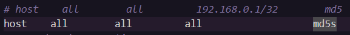
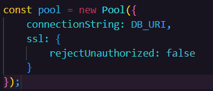
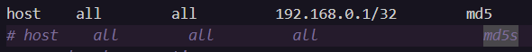
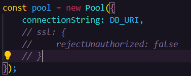

# BizNiche

marketplace platform tailored for startups, allowing them to easily find and purchase essential items from various sellers.

!! Important While Settiing Up PG DB locally or in cloud !!

1. sometimes the could connection string will connect at the first try if it did so ignore the following steps

### YOUR POSTGRES CONNECTION STRING LOOKS LIKE:

# postgresql://[username]:[password]@[host]:[server]/[database]

2. If your cloud connection string of postgres failed connecting change these two in your pg_bha.config file.
   
   

3. While switching to local pgAdmin or anyother local pg database make sure your pg_hba looks like:
   
   
